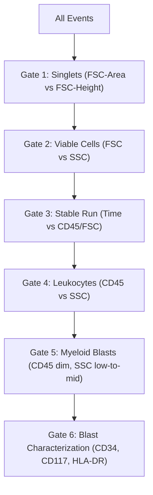

# Guidelines for Flow Cytometric Immunophenotyping, Gating, and Cell Identification in Acute Myeloid Leukemia (AML)

This guide provides standardized instructions for the clinical and technical application of multicolor flow cytometry in the diagnosis, classification, and minimal residual disease (MRD) monitoring of Acute Myeloid Leukemia (AML). It integrates recommendations from the **British Committee for Standards in Haematology (Johansson et al., 2014)**, the **EuroFlow Consortium Standardization Protocols (Leukemia, 2012)**, and the clinical findings from the **ClearLLab 10C Immunophenotyping Casebooks**.

---

## 1. Clinical Workflow & Pre-Analytical Requirements

Flow cytometric findings must always be interpreted in conjunction with morphological, cytogenetic, and molecular analyses.

### 1.1 Sample Collection and Anticoagulants
* **EDTA (K3EDTA)**: Recommended as the universal anticoagulant for peripheral blood (PB) and bone marrow (BM) aspirates. EDTA preserves cell morphology, allowing for immediate smear evaluation alongside flow cytometry. However, granulocyte cell death increases significantly after 12–24 hours.
* **Sodium Heparin**: Best preserves myeloid and granulocytic cell surface antigens for quantitative and maturation studies. It is preferred for samples requiring transport (stable for 48–72 hours) and for workups involving myelodysplastic syndrome (MDS).
* **Morphological Correlation**: Fresh blood or bone marrow smears must be prepared and examined immediately in conjunction with flow cytometry to assess sample quality (e.g., hemodilution, clotting, presence of spicules) and guide initial panel selection.

### 1.2 Sample Stability and Storage
* Stained samples must be acquired on the flow cytometer **within 1 hour** of completing the staining protocol.
* If immediate acquisition is not possible, store samples at **4°C in the dark** for a maximum of 3 hours. Tandem fluorochromes are prone to energy-transfer degradation (FRET breakdown) when exposed to light or stored at room temperature, leading to artifactual false-positive signals.

### 1.3 Pre-Treatment for Samples with Low Cellularity (Bulk Lysis)
For paucicellular samples (e.g., pediatric MDS, post-chemotherapy marrow, or hypocellular specimens):
* Perform **bulk erythrocyte lysis** using ammonium chloride ($NH_4Cl$) prior to antibody staining.
* Centrifuge the lysed sample to concentrate nucleated cells. Titrate antibody volumes based on the concentrated sample to ensure optimal signal-to-noise ratio and standard Mean Fluorescence Intensity (MFI) values.

---

## 2. Flow Cytometer Settings & Optimization SOP

Instrument standardization is essential to achieve reproducible results across cytometers and to enable data merging and automated analysis.

### 2.1 Daily Quality Control (QC) & PMT Voltage Tracking
* **Daily Performance Check**: Run daily system checks using multi-peak fluorescent calibration beads (e.g., Rainbow beads) to monitor laser delays, optical alignment, and fluidics.
* **PMT Voltage Tracking**: PMT voltages must be tracked and adjusted daily to compensate for laser drift and maintain stable Target MFI values. This ensures all target populations remain within the cytometer's linear range.
* **Stacking Avoidance**: Do not operate PMTs outside their linear range. High voltage can cause signal saturation (stacking of events on the axis), while low voltage compromises the resolution of weak positive signals.

### 2.2 Fluorescence Compensation and Tandem Fluorochromes
* Inaccurate compensation is the primary source of diagnostic error in multicolor flow cytometry.
* **Compensation Controls**: Set compensation using the brightest signal in each channel. Use antibody-capture beads (e.g., CompBeads) or single-stained cell controls.
* **Tandem Fluorochrome Lot-Specific Matrices**: Compound tandem dyes (e.g., PE-Cy7, APC-H7) exhibit significant lot-to-lot and manufacturer variation in their FRET efficiency. A separate, lot-specific compensation matrix must be generated and verified for each new batch of tandem-conjugated antibodies.
* **Verification**: Verify compensation matrices visually using Logicle (bi-exponential) displays to ensure negative and positive populations align properly and do not show "undercompensation" or "overcompensation" curves.

### 2.3 Fluorochrome Selection Principles
* Match fluorochrome brightness to antigen density:
  * **Dim antigens** (e.g., CD34, CD117, CD13) must be paired with **bright fluorochromes** (e.g., PE, APC).
  * **Bright antigens** (e.g., CD45, CD38) can be paired with **dimmer fluorochromes** (e.g., FITC, Pacific Blue).
* Avoid steric hindrance by ensuring that co-expressed markers in the panel are not conjugated to fluorochromes that interfere with each other's binding.

### 2.4 Controls
* **Fluorescence Minus One (FMO) Controls**: Mandatory for defining gating boundaries of dim or continuously expressed markers (e.g., CD34, HLA-DR, CD135) and for validating new multicolor antibody panels. FMOs are highly recommended to resolve gating boundaries in suspected Acute Promyelocytic Leukemia (APML/M3) where CD34 and HLA-DR are characteristically negative/dim.
* **Internal Negative Controls**: Use native cell populations within the same tube (e.g., mature lymphocytes as negative controls for myeloid markers) rather than isotype controls to set positivity thresholds.
* **Isotype Controls**: Should **not** be used to report percentages of positive cells. They are acceptable only for monitoring non-specific background binding in intracellular stainings.

---

## 3. Staining Protocol SOPs (Based on EuroFlow Standards)

| Protocol | Applied To | Key Reagents | Critical Steps |
| :--- | :--- | :--- | :--- |
| **Surface Membrane Only (SLW)** | Standard immunophenotyping tubes (AML/MDS Tubes 1-3, 5-7, ALOT) | FACS Lysing Solution (1x), PBS-BSA buffer | 1. Add surface antibodies.<br>2. Incubate 15 min at RT in dark.<br>3. Add 2 mL 1x FACS Lysing Solution.<br>4. Incubate 10 min at RT in dark.<br>5. Centrifuge (5 min at 540 g), wash with PBS-BSA.<br>6. Resuspend in 200 µL PBS-BSA. |
| **Combined Surface & Intracellular** | Intracellular target tubes (e.g., Cytoplasmic MPO, cCD3, cCD79a) | Fix&Perm Reagents A (Fixative) & B (Permeabilizer) | 1. Stain cell surface markers, incubate, wash.<br>2. Resuspend pellet, add 100 µL Reagent A, incubate 15 min at RT in dark.<br>3. Wash with PBS-BSA.<br>4. Add 100 µL Reagent B + intracellular antibodies.<br>5. Incubate 15 min at RT in dark, wash.<br>6. Resuspend in 200 µL PBS-BSA. |
| **Nuclear TdT (NuTdT) SOP** | Tube 4 (AML/MDS Panel) | FACS Lysing Solution, TdT-specific antibody | 1. Process surface markers as per SLW.<br>2. Add TdT antibody to the cell pellet.<br>3. Incubate 15 min at RT in dark.<br>4. Wash with PBS-BSA.<br>5. Resuspend in 200 µL PBS-BSA.<br>*(Note: Avoids Fix&Perm to preserve FSC/SSC characteristics)* |

---

## 4. Gating Strategy for Myeloid Blast Identification

To identify and characterize myeloid blasts, follow this sequential gating hierarchy.



### 4.1 Step-by-Step Gating SOP
1. **Doublet Exclusion (Singlet Gate)**: Plot Forward Scatter Area (FSC-A) vs. Forward Scatter Height (FSC-H) or Forward Scatter Integral (FS INT) vs. Forward Scatter Peak (FS PEAK). Gate the linear diagonal population to exclude cell aggregates and doublets.
2. **Debris and Dead Cell Exclusion (Cells Gate)**: Plot Side Scatter (SSC) vs. Forward Scatter (FSC) of the singlets. Exclude low-FSC debris. Apoptotic and necrotic cells have altered scatter characteristics and must be gated out.
3. **Fluidics Stability Check (Time Gate)**: Plot Time vs. CD45 or Time vs. FSC. Monitor event acquisition rate. Exclude intervals showing fluidic hiccups, clogs, or pressure perturbations.
4. **Lineage Segregation (CD45+ Gate)**: Plot CD45 vs. Side Scatter (SSC). Identify the major leukocyte populations:
   * **Lymphocytes (Ly)**: $CD45^{\text{bright}}$, $\text{SSC}^{\text{low}}$ (red/orange)
   * **Monocytes (Mo)**: $CD45^{\text{bright}}$, $\text{SSC}^{\text{intermediate}}$ (green)
   * **Granulocytes (Gr)**: $CD45^{\text{dim/moderate}}$, $\text{SSC}^{\text{high}}$ (blue)
   * **Early Progenitors/Blasts**: $CD45^{\text{dim}}$, $\text{SSC}^{\text{low-to-intermediate}}$ (purple)
5. **Myeloid Blast Gating**:
   * Blasts typically reside in the **CD45 dim / SSC low-to-mid** region.
   * Draw a gate on the CD45 dim population.
   * Project this gate onto **CD34 vs. SSC** and **CD117 vs. SSC** plots to isolate and quantify the blast fraction.
   * Back-gate the identified blast population onto the FSC vs. SSC and CD45 vs. SSC plots to verify their scatter properties and ensure no mature cell populations are contaminating the gate.

---

## 5. Key Immunophenotypic Markers for AML & FAB Classification

### 5.1 Myeloid Progenitor & Differentiation CD Markers

| Marker | Normal Expression | Expression Pattern in AML Blasts |
| :--- | :--- | :--- |
| **CD45** | Expressed on all white blood cells; density increases with maturation. | Expressed at a **dim** level on blasts, facilitating initial gating. |
| **CD34** | Early hematopoietic stem cells and progenitors. Absent on mature myeloid cells. | Expressed on hematopoietic stem cells and myeloid blasts. Typically **positive** in M0, M1, M2, M4, M5. Characteristically **negative/absent** in M3 (APML). |
| **CD117 (c-kit)** | Myeloid progenitors, early promyelocytes, and early erythroid precursors. | Expressed on myeloid blasts and promyelocytes. Positive in M0, M1, M2, M4. **Negative/absent** in M3 (APML), M5, and M7. |
| **CD33** | Highest on monocytes; moderate on immature granulocytes; low on mature granulocytes. | Expressed on almost all AML cases (M0–M5). Typically **intermediate to bright** ($CD33^{+++}$ in M3/APML). |
| **CD13** | Monocytes, maturing granulocytes, and myeloid progenitors. | Expressed variably on myeloid blasts. Often shows **decreased, dim, or absent** expression in abnormal blasts compared to normal progenitors. |
| **CD38** | Plasma cells, early progenitors, and activated lymphocytes. | Uniformly expressed on lineage-committed early progenitors. Positive on most AML blasts. |
| **HLA-DR** | B cells, monocytes, dendritic cells, activated T cells, and CD34+ progenitors. | Expressed on most myeloid blasts. Characteristically **negative/absent** in M3 (APML). |
| **CD123 (IL-3Rα)** | Basophils, plasmacytoid dendritic cells, monocytes, and myeloid progenitors. | Expressed at an **intermediate** level on AML blasts. Helpful in distinguishing blasts from lymphoid precursors. |
| **CD15** | Expressed during granulocytic differentiation (promyelocyte to granulocyte). | **Negative** on early blasts (M0, M1); acquired on maturing blasts in M2 and monocytic/myeloid subsets in M4. |
| **CD14 / CD64** | Mature monocytes. CD64 is also dim on granulocytes. | Positive in acute myelomonocytic leukemia (M4) and acute monocytic leukemia (M5). Negative in M0, M1, M2, M3. |
| **MPO (Intracellular)** | Myeloperoxidase in primary granules of granulocytes and monocytes. | **Hallmark of myeloid differentiation**. Intracellular staining is positive in M1, M2, M3, M4; negative or $<3\%$ in M0. |

---

### 5.2 FAB Subtype Immunophenotypic Profiles

AML is classified morphologically and immunophenotypically according to the French-American-British (FAB) system:

```
                  ┌──► M0 (Minimal): CD34+, CD117+, HLA-DR+, MPO- (cytochemical)
                  ├──► M1 (No Maturation): CD34+, CD117+, HLA-DR+, MPO+ (intracellular)
                  ├──► M2 (With Maturation): CD34+, CD117+, HLA-DR+, MPO++, CD15+
                  │
AML Blasts ───────┼──► M3 (APML): CD34-, CD117-, HLA-DR-, CD11b-, CD33+++, MPO+++
(CD45 dim)        │
                  ├──► M4 (Myelomonocytic): CD34+, HLA-DR+, CD13+, CD33++, CD11b+, CD14+
                  ├──► M5 (Monocytic): CD34+/-, HLA-DR+++, CD33+++, CD14+, CD64+, MPO dim
                  │
                  ├──► M6 (Erythroid): Glycophorin A (Gly-A)+, CD71+
                  └──► M7 (Megakaryoblastic): CD41+, CD61+
```

1. **M0 (Acute Myeloblastic Leukemia with Minimal Differentiation)**:
   * *Profile*: $CD34^+$, $CD117^+$, $\text{HLA-DR}^+$, $\text{CD13}^+$, $\text{CD33}^{+/-}$, $\text{CD38}^+$.
   * *Critical feature*: Myeloperoxidase (MPO) is negative by standard cytochemistry, but early myeloid lineage is established by flow cytometric expression of CD117 and CD33.
2. **M1 (Acute Myeloblastic Leukemia without Maturation)**:
   * *Profile*: $CD34^+$, $CD117^+$, $\text{HLA-DR}^+$, $\text{CD13}^+$, $\text{CD33}^+$, $\text{CD38}^+$, $\text{MPO}^+$.
   * *Critical feature*: $\text{CD15}^-$ (no granulocytic maturation).
3. **M2 (Acute Myeloblastic Leukemia with Maturation)**:
   * *Profile*: $CD34^+$, $CD117^+$, $\text{HLA-DR}^+$, $\text{CD13}^+$, $\text{CD33}^+$, $\text{CD38}^+$, $\text{MPO}^{++}$, $\text{CD15}^+$, $\text{CD11b}^+$.
   * *Critical feature*: Co-existence of primitive blasts and cells showing granulocytic maturation.
4. **M3 (Acute Promyelocytic Leukemia - APML)**:
   * *Profile*: $CD34^-$ (characteristically negative), $CD117^-$ (or dim/variable), $\text{HLA-DR}^-$ (characteristically negative), $\text{CD11b}^-$, $\text{CD18}^-$, $\text{CD33}^{+++}$ (homogeneous, extremely bright), $\text{CD13}^+$, $\text{MPO}^{+++}$ (strongly positive).
   * *Prognostic Significance*: **Medical Emergency**. Associated with $t(15;17)$ translocation yielding the $PML\text{-}RARA$ fusion gene. Patients present with high risk of severe Disseminated Intravascular Coagulation (DIC). Rapid flow recognition ($CD34^-$, $\text{HLA-DR}^-$, $\text{CD33}^{+++}$) dictates immediate initiation of All-Trans Retinoic Acid (ATRA) therapy before cytogenetic confirmation.
5. **M4 (Acute Myelomonocytic Leukemia)**:
   * *Profile*: $CD34^+$, $CD117^{+/-}$, $\text{HLA-DR}^+$, $\text{CD13}^+$, $\text{CD33}^{++}$, $\text{CD11b}^+$, $\text{CD18}^+$, $\text{CD14}^+$, $\text{CD64}^+$, $\text{MPO}^+$.
   * *Critical feature*: Mix of myeloblasts ($CD34^+$, $CD117^+$) and monoblasts ($CD14^+$, $CD64^+$).
6. **M5 (Acute Monocytic Leukemia)**:
   * *Profile*: $CD34^{+/-}$ (often negative on mature monoblasts), $CD117^-$, $\text{HLA-DR}^{+++}$, $\text{CD33}^{+++}$, $\text{CD13}^+$, $\text{CD11b}^+$, $\text{CD18}^+$, $\text{CD14}^+$, $\text{CD64}^+$, $\text{MPO}^{\text{weak/negative}}$.
   * *Critical feature*: Dominance of monoblasts and promonocytes with high side scatter and strong monocyte antigen expression.
7. **M6 (Acute Erythroid Leukemia)**:
   * *Profile*: $\text{Glycophorin A}^+$ (Gly-A), $CD71^+$ (transferrin receptor). Blasts are negative for standard myeloid markers (CD34, CD117, CD33).
8. **M7 (Acute Megakaryoblastic Leukemia)**:
   * *Profile*: $CD41^+$ (GP IIb/IIIa), $CD61^+$ (GP IIIa). Typically positive for CD34 and CD117.

---

### 5.3 Aberrant Marker Expression (Leukemia-Associated Immunophenotypes - LAIP)
Myeloid blasts in AML frequently express lymphoid markers or show atypical myeloid antigen intensity. These aberrant phenotypes are critical for diagnostic specificity and serve as valuable markers for **Minimal Residual Disease (MRD)** tracking.

* **Aberrant Lymphoid Markers**:
  * **CD7**: A T-cell/NK marker aberrantly expressed in up to $30\%$ of AML cases. Associated with immature blast phenotypes (M0/M1) and poor prognosis.
  * **CD19**: A B-cell marker aberrantly expressed in AML, particularly associated with the $t(8;21)$ translocation (FAB M2 subtype).
  * **CD56**: An NK-cell marker that is aberrantly expressed in AML and associated with drug resistance (P-glycoprotein expression) and poor clinical outcome.
  * **CD2**: A T-cell marker aberrantly expressed in some cases of monocytic AML (M4/M5) or APML (M3).
* **Lineage Infidelity & Prognosis**:
  * Tracking these aberrant markers (e.g., $CD34^+CD7^+$ or $CD34^+CD19^+$ blasts) allows the detection of small numbers of leukemic events down to $<0.01\%$ in post-treatment bone marrow samples, even when morphology appears normal ($<5\%$ total blasts).
  * In contrast, aberrant myeloid marker expression on lymphoid leukemias also has clinical relevance (e.g., CD117 expression on T-ALL indicates a poorer prognosis compared to CD117-negative cases).

---

## 6. Diagnostic Reporting and Interpretation Standards

A standardized clinical report should contain the following elements to ensure complete integration into the patient's care record:

1. **Pre-Analytical Audit Trail**: Document sample type (PB or BM), collection date, processing date, anticoagulant used, and cell viability. State limitations explicitly (e.g., "Sample received $>24$ hours post-collection; potential granulocyte degeneration observed").
2. **Leukocyte Differential (Flow Differential)**: Report percentages of major populations (Lymphocytes, Monocytes, Granulocytes, and Blasts) relative to total CD45+ events. Contrast these values with morphology results.
3. **Blast Phenotype Summary**: Provide a clear narrative describing the blast population's light scatter properties (FSC/SSC) and CD antigen expression profile. Use standardized intensity descriptors:
   * **Bright/Strong**: Signal intensity matches or exceeds the normal positive control population.
   * **Moderate/Intermediate**: Clearly resolved positive population, but lower intensity than normal positive controls.
   * **Dim/Weak**: Small shift from the negative population; requires FMO to confirm gating.
   * **Negative/Absent**: No shift from the negative control population.
4. **Aberrant Phenotype Statement**: Explicitly detail any leukemia-associated immunophenotypes (LAIP) detected (e.g., "The blast population exhibits aberrant CD7 expression and dim CD13 expression compared to normal myeloblasts").
5. **Diagnostic Conclusion**: Provide a concise summary statement (e.g., "Flow cytometric immunophenotyping identifies an expanded population of CD34-positive progenitors (12% of total nucleated cells) with myeloid differentiation, consistent with Acute Myeloid Leukemia (AML) M1/M2 subtype. Correlation with cytogenetics and molecular testing is required for definitive WHO classification").
