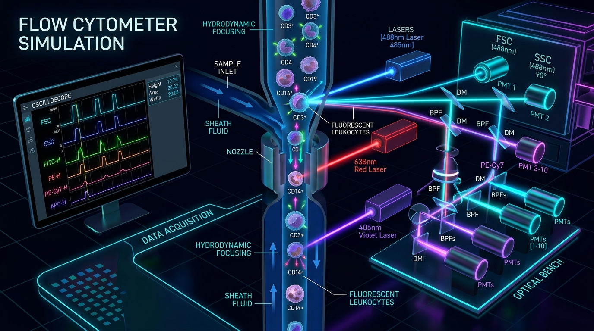

<<<<<<< HEAD
# Immunophenotyping & Flow-Gate Learn Interactive Trainer

[](LICENSE)
[](https://threejs.org/)
[](https://developer.mozilla.org/)

An open-source interactive clinical reference, 3D cellular explorer, and gating trainer for **Flow Cytometric Immunophenotyping of Haematological Malignancies**. Designed for hematology trainees, pathologists, and laboratory scientists to learn single-cell leukocyte gating, 10-color panel interpretation, and differentiation of acute myeloid leukemia (AML FAB subtypes M0 through M7).

---

## 🎓 How to Learn from the Flow Cytometry Trainer

The application offers 5 primary interactive learning workflows:

### 1. 📊 Interactive Bivariate Gating
- Draw rectangular and polygonal gates on bivariate scatter plots (FSC vs SSC, FSC-A vs FSC-H, CD45 vs SSC, CD34 vs CD117).
- Master sequential gating: **Singlet Gate** (FSC_A vs FSC_H) → **Viable Cells Gate** → **CD45 vs SSC Cell Population Separation**.

### 2. 🧪 10-Color Panel Tube Selection
- Switch between 4 specialized antibody panel tubes using the **Plot Gallery** sidebar tab:
  - **B Cell Tube**: Kappa, Lambda, CD10, CD5, CD200, CD34, CD38, CD20, CD19, CD45
  - **T Cell Tube**: TCRγδ, CD4, CD2, CD56, CD5, CD34, CD7, CD8, CD3, CD45
  - **M1 Myeloid Tube**: CD16, CD7, CD10, CD13, CD64, CD34, CD14, HLA-DR, CD11b, CD45
  - **M2 Myeloid Tube**: CD15, CD123, CD117, CD13, CD33, CD34, CD38, HLA-DR, CD19, CD45

### 3. ⚖️ Normal vs AML Control Comparison ("Compare Normal vs Selected AML")
- Select **Compare Normal vs Selected AML** in the case study header dropdown.
- Inspect dual split-screen plots contrasting normal baseline (Case #1) against FAB AML subtypes (**AML-M0 Minimally Differentiated**, **AML-M1 Without Maturation**, **AML-M2 With Maturation**, **AML-M3 APL Promyelocytic**, **AML-M4 Acute Myelomonocytic**, **AML-M5 Acute Monocytic**, **AML-M6 Acute Erythroid**, **AML-M7 Acute Megakaryoblastic**).

### 4. 🧬 3D Cellular Explorer & Receptor Inspection
- Rotate, zoom, and interact with real-time 3D leukocyte cell models rendered in Three.js.
- Inspect surface receptor expressions (CD4, CD8, CD34, CD117, HLA-DR).

### 5. 🎬 Interactive SVG Gating & Population Shift Simulator
- Click **"🎓 How to Learn (Interactive Guide)"** in the top navigation bar to open the interactive educational guide and live SVG gating simulator sandbox.

---

## 🚀 Getting Started

Simply open `flow-cytometry-trainer/index.html` in any web browser!

```bash
# Clone the open-source repository
git clone https://github.com/MinerJS/Immunophenotyping.git
cd Immunophenotyping/flow-cytometry-trainer

# Open in browser or serve with any static web server
python3 -m http.server 8000
```

Visit [http://localhost:8000/flow-cytometry-trainer/](http://localhost:8000/flow-cytometry-trainer/) in your browser.

---

## 📜 License

Released under the [MIT License](LICENSE).
=======
# Flow-Gate Learn: Interactive Flow Cytometry & Immunophenotyping Trainer

[](LICENSE)
[](https://github.com/MinerJS/Immunophenotyping)
[](#)

An open-source, interactive web-based simulator and diagnostic trainer for clinical flow cytometry, leukocyte immunophenotyping, and Acute Myeloid Leukemia (AML) classification across WHO / FAB subtypes (M0 through M7).

Developed in alignment with international guidelines:
- **Johansson et al. (2014)**: *Guidelines on the use of multicolour flow cytometry in the diagnosis of haematological malignancies* (British Journal of Haematology).
- **EuroFlow Protocols (2012)**: *Standardization of flow cytometer instrument settings and immunophenotyping protocols*.
- **ClearLLab 10C System**: 10-color dry antibody panels (B-Cell, T-Cell, Myeloid M1, Myeloid M2) on Beckman Coulter Navios / Navios EX instruments.

---

## 🔬 Interactive Application Features & Page Guides



The application consists of 5 main workspace views, accessible from the vertical activity bar on the left:

### 1. 📊 Interactive Plot Area & Gating Tools (`Plot Gallery View`)
- **Dual Case Comparison**: Select between **Normal Whole Blood (Case #1)**, **AML Case #18**, or individual **FAB Subtypes (M0-M7)**. Toggle **Compare Mode** to view Normal vs. AML side-by-side with synchronized gating coordinates.
- **Tube Panels**: Switch seamlessly between ClearLLab 10C Panels:
  - **B-Cell Tube**: CD45, CD19, CD20, CD10, CD5, CD38, CD200, Kappa, Lambda, CD34.
  - **T-Cell Tube**: CD45, CD3, CD4, CD8, CD5, CD7, CD2, CD56, TCR-γδ, CD34.
  - **Myeloid M1 Tube**: CD45, CD34, CD117, CD13, CD33, CD11b, CD14, CD16, HLA-DR, CD15.
  - **Myeloid M2 Tube**: CD45, CD34, CD117, CD71, CD105, CD41, CD61, CD64, CD33, HLA-DR.
- **Gating Tools Toolbar**:
  - **Rectangle Gate (`Rect`)**: Drag to bound specific cell populations on FSC vs SSC or antibody fluorophore axes.
  - **Polygon Gate (`Poly`)**: Click vertices to draw custom multi-point polygonal blast or lymphocyte gates.
  - **Auto Gate (`Auto`)**: Automated cluster boundary calculation for Lymphocytes, Monocytes, Granulocytes, and AML Blasts.
  - **Zoom & Cell Inspector (`Zoom`)**: Select any gated sub-population to launch the **3D Cell & Receptor Inspector**.

---

### 2. 🧊 3D Cell & Morphology Inspector (Cell Micro-structure & Receptors)
- **WebGL 3D Cell Models**: Rendered in Three.js with realistic membrane displacement, lipid bilayer translucency, nucleus-to-cytoplasm ratio (N:C), cytoplasmic granules, and surface cluster of differentiation (CD) receptor proteins.
- **Interactive Controls**:
  - **Rotation & Orbit**: Drag to rotate cells in 3D space to inspect receptor distribution.
  - **Receptor Toggles**: Click CD markers in the legend to highlight specific fluorescently labeled antibodies (e.g. CD34-PE, CD117-APC, CD45-PB).
  - **Cytoplasm & Nucleus Transparency**: Adjust slider controls to visualize internal lobulation (e.g., hypersegmented neutrophils vs. blast mononucleoli).

---

### 3. ⚙️ Flow Cytometer Instrument Simulator (`Simulator View`)
An optical, fluidic, and electronic subsystem simulator modeling a 10-color 3-laser flow cytometer:
- **Hydrodynamic Focusing**: Simulates sample core stream injection into sheath fluid. Adjust flow rates:
  - **Low (10 µL/min)**: Narrowest core stream, single-file cell passage, <0.1% doublets, tightest CVs.
  - **Medium (30 µL/min)**: Standard operational flow rate (~2% coincidence).
  - **High (60 µL/min)**: Broad core stream, increased throughput, ~15% coincidence doublets.
- **Optical Interrogation**:
  - **488 nm Blue Laser** (FSC, SSC, FITC, PE, PerCP-Cy5.5, PE-Cy7)
  - **638 nm Red Laser** (APC, APC-R700, APC-Cy7)
  - **405 nm Violet Laser** (Pacific Blue, Krome Orange)
- **Oscilloscope Signal Electronics**: Live pulse height ($H$), area ($A$), and width ($W$) voltage curves as cells cross laser beam spots.
- **Doublet Exclusion**: Interactive FSC-A vs FSC-H gating demonstrating why singlet cells align diagonally while doublets fall below the diagonal due to increased time-of-flight (width).

---

### 4. 🩺 Leukaemia Reference & Phenotype Predictor (`Leukaemia View`)
- **Interactive Phenotype Builder**: Toggle CD surface markers ($+ / - / \text{dim}$) to test immunophenotypes.
- **Diagnostic Engine**: Calculates match percentage across AML FAB subtypes (M0–M7), B-ALL, T-ALL, CLL, and CML.
- **Interactive Flowcharts**: Visual decision trees mapping clinical algorithms for acute leukemia lineage assignment (Myeloid vs. B-Lymphoid vs. T-Lymphoid).

---

### 5. 📚 Comprehensive Reference Library (`Glossary View`)
- Consolidated clinical dictionary covering 40+ CD markers, gating definitions, sample preparation SOPs, and EuroFlow panel recommendations.
- Instant search and category filtering (Gating Basics, ClearLLab Tubes, FAB Subtypes, CD Markers, Clinical Protocols).

---

## ⚡ Quick Start / Local Server

To run the application locally without external dependencies:

```bash
# Clone the repository
git clone https://github.com/MinerJS/Immunophenotyping.git
cd Immunophenotyping/flow-cytometry-trainer

# Option 1: Python built-in HTTP server
python3 -m http.server 8000

# Option 2: Node.js http-server / serve
npx http-server . -p 8000
```

Open your browser to `http://localhost:8000`.

---

## 🤝 Open Source License

This project is licensed under the [MIT License](LICENSE). Contributions, bug reports, and educational enhancements are welcome!
>>>>>>> 5e35099 (Make project open source with MIT License, comprehensive README, diagram assets, and Interactive Learning Guide with Animations)
