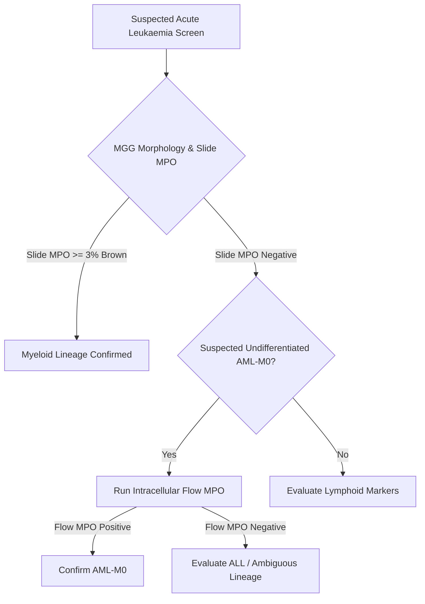
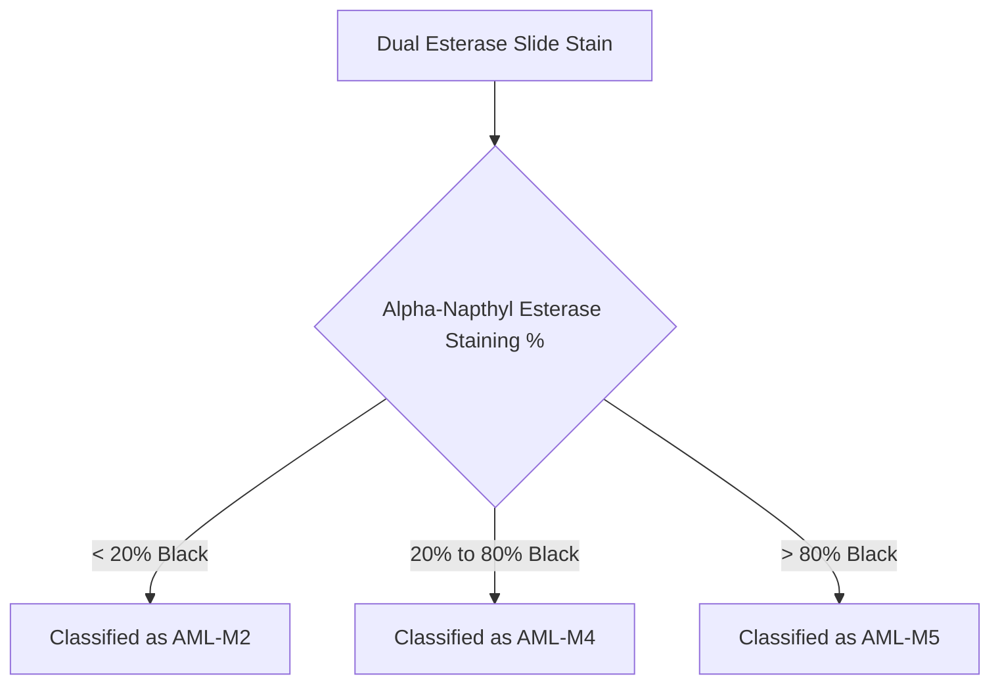
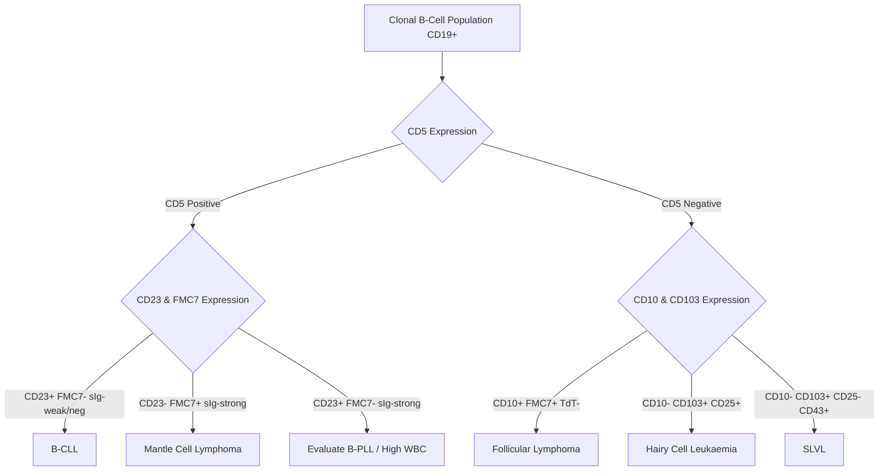

# SOP: Immunophenotypic Interpretation of Haematological Malignancies

* **Document ID**: FFC-MP2-9 (Replaces SOP1772)
* **Status**: Active
* **Review Date**: 23/11/2024
* **Author**: Evan Vitsaras (Consultant)
* **Owner**: Karen Orfinada (Flow Cytometry Lead)
* **Target Audience**: Fully trained flow cytometry staff, clinical staff, and staff in training.

---

## 1. Introduction & Scope

This protocol provides standard instructions for the immunophenotypic interpretation of results obtained from flow cytometric analysis of bone marrow (BM), peripheral blood (PB), cerebrospinal fluid (CSF), and other clinical fluids.

> [!IMPORTANT]
> This protocol serves as a clinical guideline and is not absolute. Complex cases with atypical phenotypes require consultation with the lead clinician in charge of Flow Cytometry (Evan Vitsaras) or the designated back-up consultants on the clinical rota.

---

## 2. Core Concepts: Aberrant Marker Expression

Most markers used in immunophenotyping are lineage-specific and help determine cell lineage. However, antigens can be aberrantly expressed on lineages where they do not normally belong (e.g., B-cell markers on myeloid cells).

### 2.1 Clinical Significance of Aberrant Markers
1. **Minimal Residual Disease (MRD) Tracking**: Aberrant phenotypes create a unique "leukaemic template" or leukaemia-associated immunophenotype (LAIP). This is highly useful for tracking small volumes of residual disease in bone marrow during morphological remission (where marrow blasts are $< 5\%$).
2. **Prognostic Indicators**: The presence or absence of certain aberrant markers has prognostic value. For example, CD117 expression on T-ALL blasts is associated with a significantly poorer prognosis compared to CD117-negative T-ALL.

### 2.2 Table of Aberrant Antigen Expressions

| Marker | Normal Lineage | Aberrantly Expressed On | Clinical Notes |
| :--- | :--- | :--- | :--- |
| **CD2** | T-cells & NK-cells | AML (specifically AML-M3 and AML-M3V) | Useful for tracking Promyelocytic Leukaemia MRD |
| **CD7** | T-cells (earliest marker) | AML (approx. 30% of cases) | Indicates poor prognosis in AML; useful for MRD |
| **CD5** | T-cells | B-CLL & Mantle Cell Lymphoma (MCL) | Key marker in mature B-cell lymphoproliferative disorders |
| **CD13** | Myeloid cells | Precursor B-ALL & T-ALL | Used for MRD tracking in lymphoblastic leukaemias |
| **CD33** | Myeloid & Monocytic cells | Precursor B-ALL | Rare aberrancy; target for anti-CD33 (Gemtuzumab/Mylotarg) |
| **CD117**| Myeloid blasts only | T-ALL | Associated with mediastinal mass in young males; poor prognosis |
| **CD56** | NK-cells | MDS (RAEB) & transforming AMLs | Strong indicator of imminent MDS transformation |
| **CD19** | B-cells | AML | Used for MRD tracking; does not imply poor prognosis |
| **TdT** | Lymphoblasts | AML (very rare, $< 1\%$ in UCH laboratory) | Nuclear enzyme; must be interpreted carefully |

---

## 3. Interpreting Flow Cytometer Print-Outs & Histograms

Interpretation relies on a combination of light-scatter properties and fluorescence intensities.

### 3.1 Gating on CD45 vs. Log Side Scatter (SS)
The CD45 vs. Side Scatter density plot is the primary gate for separating leukocyte populations based on antigen density and internal complexity (granularity):

```
CD45-PE Intensity (Log)
  ▲
  │   ┌────────────────┐
  │   │  Lymphocytes   │                  Granulocytes
  │   │ (CD45hi SSlo)  │                 (CD45mid SShigh)
  │   └────────────────┘                ┌────────────────┐
  │                                     │                │
  │            ┌───────────────┐        │                │
  │            │   Monocytes   │        └────────────────┘
  │            │ (CD45hi SSmid)│
  │            └───────────────┘
  │
  │      ┌───────────────┐
  │      │ Myeloid/Lymph │
  │      │ Blasts (dim)  │
  │      └───────────────┘
  │
  │  ┌──────────┐
  │  │  Debris  │
  │  └──────────┘
  └────────────────────────────────────────────────────────► Side Scatter (SS) Log
```

### 3.2 Quadstat Analysis (e.g., CD34-APC vs. CD117-PC7)
Quadstats divide a two-color plot into four quadrants to identify single-positive, dual-positive, and double-negative populations:
* **Quadrant 1 (Q1)**: CD117-PC7 single positive.
* **Quadrant 2 (Q2)**: CD34-APC and CD117-PC7 dual positive (typical primitive myeloid blast signature).
* **Quadrant 3 (Q3)**: Double negative population (used as gating controls).
* **Quadrant 4 (Q4)**: CD34-APC single positive.

---

## 4. Acute Myeloid Leukemia (AML) Decision Guide

The World Health Organisation (WHO) guidelines emphasize distinguishing AML from ALL and identifying specific high-risk subtypes rather than adhering strictly to the French-American-British (FAB) categories.

> [!NOTE]
> While reporting a specific FAB subtype is no longer a strict WHO requirement, understanding the FAB categories remains essential because treatment and prognosis differ significantly between classic AML, AML-M3, and monocytic AMLs (M4/M5).

### 4.1 Classic AML (No Aberrant Markers)
* **Immunophenotype**: $CD34^+ \text{ } CD117^+ \text{ } CD33^+ \text{ } CD13^+ \text{ } \text{HLA-DR}^+ \text{ } \text{MPO}^+$
* **Morphology**: Granules present; possible Auer rods. Typically correlates with FAB AML-M2.

### 4.2 Myeloperoxidase (MPO) Cytochemistry vs. Flow Cytometry
Peroxidase is an enzyme found in primary granules. In our department, we test for MPO using two concurrent methods:

1. **Cytochemical Slide Stain (Microscopy)**:
   * **Positivity Threshold**: At least **3%** of the blast cells must stain **BROWN** under oil immersion to confirm myeloid lineage.
   * **Note**: Auer rods stain strongly even when cytoplasmic granules are sparse.
   * **Limitation**: The staining process distorts blast morphology; compare carefully with May-Grünwald-Giemsa (MGG) slides.
2. **Flow Cytometry Immunophenotyping (Intracellular Tube)**:
   * Used when cytochemical staining is negative but myeloid lineage is strongly suspected (e.g., AML-M0).
   * **Reporting**: Cytochemical slide MPO is reported qualitatively (positive/negative), while flow MPO is reported quantitatively as a percentage of positive cells.



### 4.3 Subtype-Specific Staining and Interpretations

#### AML-M0 (Minimally Differentiated)
* Undifferentiated blasts with no primary granules on MGG.
* Cytochemical slide MPO is negative.
* Flow cytometry intracellular MPO staining is required to confirm myeloid lineage.

#### AML-M1 (Without Maturation) & AML-M2 (With Maturation)
* Primary granules are visible on MGG.
* Cytochemical MPO is weakly positive (+) in M1 and strongly positive (++) in M2.
* Flow MPO is not required if cytochemical staining is positive.

#### AML-M3 (Acute Promyelocytic Leukaemia / APL) & AML-M3 Variant
This is a critical medical emergency characterized by a maturation block at the promyelocyte stage.

> [!CAUTION]
> **APL carries an extremely high risk of disseminated intravascular coagulation (DIC) and fatal clotting abnormalities.**
> Administering chemotherapy before managing the coagulopathy can trigger fatal DIC. Standard practice requires immediate treatment with ATRA (All-Trans Retinoic Acid) upon morphological suspicion, prior to immunophenotypic or cytogenetic confirmation.

* **Morphology**: Heavy primary granulation, bi-lobed nuclei, multiple nucleoli, and "fagot cells" (blasts packed with bundles of Auer rods resembling wood bundles).
* **M3 Variant (APL-V)**: Microgranular/agranular morphology on MGG. However, cytochemical MPO stains strongly positive (+++), revealing hidden primary granules.
* **Classical Immunophenotype**: **HLA-DR Negative**, **CD18 Negative**, and **CD11b Negative**.
* **Blast Markers**: CD34 and CD117 are characteristically weak or negative.
* **MRD and Confirmation**: Variant M3 often aberrantly expresses CD2. Definitive diagnosis requires cytogenetic confirmation of the $t(15;17)$ translocation (PML-RARA fusion) via FISH.

#### AML-M4 (Acute Myelomonocytic) vs. AML-M5 (Acute Monoblastic)
Distinguished by morphology and cytochemical Dual Esterase staining:
* **Chloroacetate Esterase**: Stains myeloid precursors **PINK**.
* **Alpha-Napthyl Esterase (Non-Specific)**: Stains monocytic cells **BLACK**.


* **MPO Staining**: AML-M4 shows mixed positive myeloid blasts and negative-appearing monoblasts (overall $>3\%$ positive). AML-M5 is often MPO weak or negative.
* **CD14 Expression**: CD14 is a mature monocyte marker but is fragile and frequently shed from monoblasts. Only a minority of M4/M5 cases express surface CD14; dual esterase cytochemistry remains the definitive method.

#### AML-M6 (Erythroleukaemia) & AML-M7 (Megakaryoblastic)
* MPO and esterase stains are not useful.
* Classified morphologically: AML-M6 requires $>50\%$ erythroblasts in marrow; AML-M7 requires $>30\%$ megakaryoblasts (often showing cytoplasmic blebbing).

---

## 5. Myelodysplastic Syndrome (MDS) & Chronic Myeloid Transformations

### 5.1 MDS Classification (Bone Marrow Morphology)

| MDS Subtype | BM Blast % | Key Morphological & Clinical Features |
| :--- | :---: | :--- |
| **Refractory Anaemia (RA)** | $< 5\%$ | Dysplasia primarily in red cell precursors. 20-40% transform to AML. |
| **RA with Ringed Sideroblasts (RARS)**| $< 5\%$ | Distinct iron accumulation: $\ge 15\%$ ringed sideroblasts in marrow. |
| **RA with Excess Blasts Type 1 (RAEB1)**| 5% - 9% | 50% rate of AML transformation within 6 years. |
| **RA with Excess Blasts Type 2 (RAEB2)**| 10% - 19% | 50% rate of AML transformation within 18 months. |
| **RAEB in Transformation (RAEB-T)** | 21% - 30% | Transition state. Blasts $> 30\%$ are classified as acute leukemia. |
| **Chronic Myelomonocytic Leukaemia (CMML)**| $< 20\%$ | Monocyte count in peripheral blood $> 1.0 \times 10^9/\text{L}$ with dysplasia. |

> [!WARNING]
> All classifications of MDS must be determined by bone marrow morphology blast percentages, **not** by flow cytometry.

### 5.2 Flow Cytometric Markers in MDS
* **Transforming Markers**: Aberrant expression of **CD7** and **CD56** on myeloblasts indicates a high risk of transformation to AML and correlates with a poor prognosis.
* **Predictive Value**: Detecting aberrant CD56 on $< 5\%$ marrow blasts in an MDS patient is a strong predictor of future leukemic transformation.

### 5.3 Chronic Granulocytic Leukaemia (CGL) Blast Crisis
* **Chronic Phase**: Characterized by mature neutrophils, basophils, and eosinophils in blood. Diagnosed by detecting the Philadelphia chromosome $t(9;22)$.
* **Accelerated Phase (CGL-AP)**: Defined by 10-19% blasts in BM/PB, $>20\%$ basophils, platelets $<100 \times 10^9/\text{L}$ (unrelated to therapy) or $>1000 \times 10^9/\text{L}$ (unresponsive), cytogenetic evolution, or splenomegaly.
* **Blast Crisis**: Blasts $>20\%$ in BM, large blast clusters on biopsy, or chloroma development. Phenotypically, blasts present as AML (with or without aberrant markers).

---

## 6. Acute Lymphoblastic Leukaemia (ALL) Decision Guide

ALL is highly curable in children ($\ge 94\%$ 5-year survival) but carries a poorer prognosis in adults (30-40% 5-year survival).

### 6.1 Precursor B-ALL
* **Classic Phenotype**: $CD34^+ \text{ } CD19^+ \text{ } CD10^+ \text{ } \text{TdT}^+$
* **Distinguishing from Follicular Lymphoma**: 
  * Precursor B-ALL: $CD34^+ \text{ } \text{TdT}^+ \text{ } \kappa/\lambda \text{ negative}$ (immature).
  * Follicular Lymphoma: $CD34^- \text{ } \text{TdT}^- \text{ } \kappa/\lambda \text{ restricted}$ (mature).
* **Clinical Markers**:
  * **TdT**: Essential nuclear marker; TdT-negative B-ALL does not occur.
  * **CD38**: Co-expression on $CD34^+ CD19^+ CD10^+$ blasts correlates with an increased risk of relapse.
  * **CD20**: Expressed in ~50% of cases. Rituximab therapy is indicated if blasts are $CD20^+$.
  * **Aberrant CD33**: Associated with a poor prognosis; used for MRD tracking.

### 6.2 Burkitt's Lymphoma
Burkitt's Lymphoma is a mature, highly aggressive B-cell neoplasm that can overlap immunophenotypically with B-ALL.
* **Morphology**: Homogeneous lymphoid cells with deep blue, vacuolated cytoplasm.
* **Phenotype**: **CD34 Negative**, **TdT Negative**, **CD10 Negative** (or weak), $CD19^+ \text{ } CD20^+ \text{ } CD22^+$.
* **Clonality**: Strong surface light chain restriction (either Kappa or Lambda).
* **Proliferation**: Extremely high growth rate; **Ki67** staining is strongly positive ($~100\%$).
* **Diagnosis**: Histology remains the gold standard for confirming Burkitt's lymphoma.

### 6.3 T-ALL
* **Primitive Phenotype**: $CD34^+ \text{ } CD7^+ \text{ } \text{TdT}^+ \text{ } \text{cCD3}^+$ (surface CD3 is negative).
* **Maturation Stages**: More mature T-ALLs co-express T-cell markers ($CD2, CD5, CD4, CD8, CD1a$).
* **Diagnostic & Prognostic Indicators**:
  * **CD1a**: Expression indicates a good prognosis.
  * **CD4/CD8 Co-expression**: Confirms T-ALL rather than T-cell lymphoma.
  * **TdT Negative**: Indicates a mature T-cell lymphoma, not acute T-ALL.
  * **Aberrant CD117**: Associated with a mediastinal mass in young males (12-21 years old) and cytogenetic abnormalities, representing a very poor prognosis.

### 6.4 Ambiguous (Mixed Lineage) Leukaemias
* **Biphenotypic**: Single blast population expressing both myeloid and lymphoid markers (e.g., MPO and TdT co-expression on the same cell).
* **Bilineage**: Two distinct, separate blast populations (one myeloid/MPO+, one lymphoid/TdT+).
* **Prognosis**: Ambiguous lineage leukaemias have a very poor prognosis, particularly when cytogenetic abnormalities are present.

---

## 7. Chronic B-Cell Lymphoproliferative Disorders

Mature B-cell malignancies are identified by B-cell clonality, demonstrated by surface or intracellular light chain restriction (normal $\kappa:\lambda$ ratio is $2:1$).



### 7.1 B-Chronic Lymphocytic Leukaemia (B-CLL)
* **Morphology**: Mature, fragile lymphocytes presenting with numerous smudge/smear cells on blood films. Prolymphocytes make up $< 15\%$ of the lymphoid population.
* **Phenotype**: $CD19^+ \text{ } CD5^+ \text{ } CD23^+ \text{ } CD22^- \text{ (or weak) } CD20^{\text{weak}} \text{ } \text{FMC7}^-$
* **Clonality**: Surface light chains are negative or weak; restriction is demonstrated via intracellular Kappa/Lambda staining.

### 7.2 Mantle Cell Lymphoma (MCL) vs. B-CLL
* **Morphology**: Similar to CLL, but smudge cells are rare. Cells may show nuclear clefts.
* **Phenotype**: $CD19^+ \text{ } CD5^+ \text{ } \mathbf{CD20^{bright}} \text{ } \mathbf{CD22^{bright}} \text{ } \mathbf{FMC7^+} \text{ } \kappa/\lambda \text{ strongly positive}$.
* **Confirmation**: MCL is Cyclin D-1 positive by immunohistochemistry, whereas B-CLL is negative.

### 7.3 B-Prolymphocytic Leukaemia (B-PLL)
* **Clinical Criteria**: Extreme lymphocytosis (WBC $> 100 \times 10^9/\text{L}$, occasionally up to $800 \times 10^9/\text{L}$).
* **Morphology**: Large, mature lymphocytes with prominent nucleoli. Prolymphocytes must constitute **$> 55\%$** of the peripheral blood lymphocytes.
* **Phenotype**: $CD19^+ \text{ } CD5^+ \text{ } \mathbf{CD20^{bright}} \text{ } \mathbf{CD22^{bright}} \text{ } \kappa/\lambda \text{ strongly positive}$. FMC7 is typically negative.

### 7.4 Hairy Cell Leukaemia (HCL) vs. SLVL
* **Hairy Cell Leukaemia**: 
  * Characterized by cytopenias and a dry marrow tap.
  * **Morphology**: Lymphocytes with circumferential hair-like cytoplasmic projections.
  * **Phenotype**: $CD19^+ \text{ } CD20^+ \text{ } CD22^+ \text{ } \mathbf{CD103^+} \text{ } \mathbf{CD25^+}$ (CD25 positivity indicates cell activation).
* **Splenic Lymphoma with Villous Lymphocytes (SLVL)**:
  * **Morphology**: Bipolar cytoplasmic villi ("flying saucer" appearance).
  * **Phenotype**: $CD19^+ \text{ } CD20^+ \text{ } CD22^+ \text{ } \mathbf{CD103^+} \text{ } \mathbf{CD25^-} \text{ } \mathbf{CD43^+}$.

### 7.5 Follicular Lymphoma (FL)
* **Morphology**: Large clefted cells resembling lymphoblasts.
* **Phenotype**: $CD19^+ \text{ } CD10^+ \text{ } \text{FMC7}^+ \text{ } \kappa/\lambda \text{ strongly positive}$.
* **Diagnostic Pitfall**: Follicular lymphoma must be distinguished from Precursor B-ALL (both are $CD19^+ CD10^+$). FL is **TdT-negative** and light-chain restricted; B-ALL is **TdT-positive** and light-chain negative.

---

## 8. Chronic T-Cell Malignancies

Clonality in T-cell malignancies cannot be demonstrated by surface light chains; molecular T-cell receptor (TCR) gene rearrangement studies are required.

### 8.1 T-Prolymphocytic Leukaemia (T-PLL)
* Highly aggressive. Presents with skin lesions, lymphadenopathy, and splenomegaly.
* **Morphology**: Large prolymphocytes with visible nucleoli.
* **Phenotype**: $CD4^+ \text{ } CD3^-$ (surface CD3 is frequently lost, though some cases retain it).

### 8.2 Sézary Syndrome
* Cutaneous T-cell lymphoma presenting as erythroderma.
* **Morphology**: Lymphocytes with highly folded, clover-leaf/cerebriform nuclei.
* **Phenotype**: $CD4^+$ helper T-cell phenotype. Distinguished clinical picture.

### 8.3 Adult T-Cell Leukaemia/Lymphoma (ATLL)
* Aggressive neoplasm linked to the HTLV-1 virus (prevalent in populations of African origin).
* **Morphology**: Highly variable; can mimic Sézary cells.
* **Phenotype**: $CD4^+ \text{ } \mathbf{CD25^+}$ (CD25 is strongly positive).

### 8.4 Large Granular Lymphocyte (LGL) Leukaemia
* Characterized by chronic ($> 6$ months) elevation of large granular lymphocytes.
* **Morphology**: Large atypical lymphocytes with prominent cytoplasmic granules.
* **Phenotype**: $CD8^+ \text{ } CD16^+ \text{ } CD56^+ \text{ } CD57^+$.
* **Diagnosis**: Reactive LGL expansions share this phenotype. Leukaemic LGL is identified by the aberrant loss or down-regulation of pan-T markers (**CD5** or **CD7**), and confirmed via TCR gene rearrangement.

---

## 9. References & Related Documents

* **WHO Classification**: *WHO Classification of Tumours of Haematopoietic and Lymphoid Tissues (2008)*.
* **Cross-References**:
  * [SOP: Sample Preparation and Flow Analysis](file:///Users/jermin/Library/Mobile%20Documents/com~apple~CloudDocs/Education/CPD/Immunophenotyping/SOP_Sample_Preparation_and_Flow_Analysis.md) (FFC-004)
  * [AML Flow Cytometry Guide](file:///Users/jermin/Library/Mobile%20Documents/com~apple~CloudDocs/Education/CPD/Immunophenotyping/AML_Flow_Cytometry_Guide.md)
