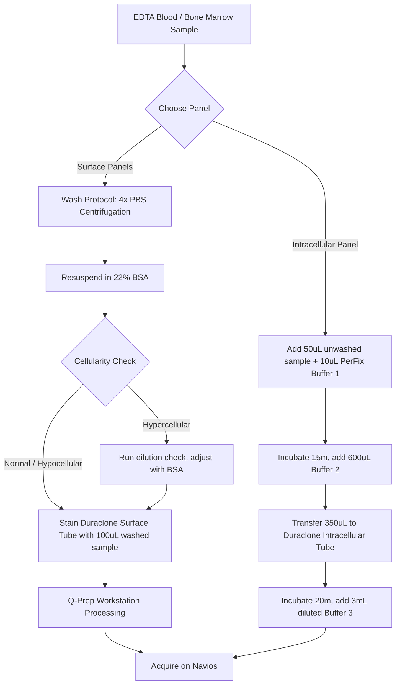
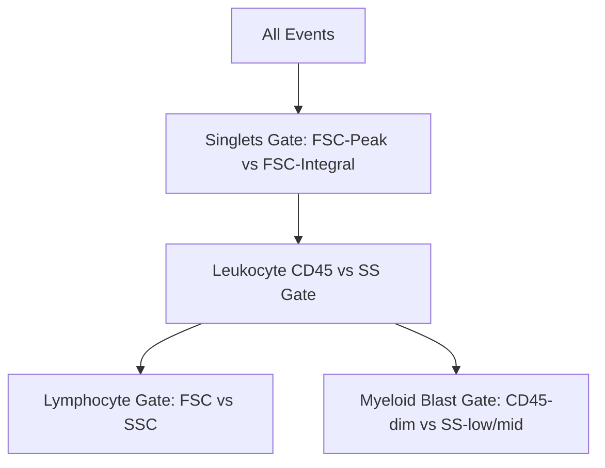

# SOP: Immunophenotyping Sample Preparation and Flow Cytometry Operation

* **Document ID**: FFC-004 (Replaces old FFC-004)
* **Status**: Active
* **Review Date**: 21/09/2024
* **Author**: Sharon Minz (BMS)
* **Owner**: Karen Orfinada (Flow Cytometry Lead)
* **Target Audience**: All laboratory and clinical staff involved in sample preparation, acquisition, and analysis.

---

## 1. Scope & Clinical Relevance

This procedure describes the steps for preparing bone marrow (BM), peripheral blood (PB), cerebrospinal fluid (CSF), and other body fluids for immunophenotypic analysis. It outlines the operation of the Beckman Coulter Navios flow cytometer, quality control checks, data export, and provisional reporting for leukemia, lymphoma, and Minimal Residual Disease (MRD).

---

## 2. Specimen Handling & Rejection Criteria

### 2.1 Specimen Requirements

| Sample Type | Primary Diagnostic Use | Collection Container | Storage Temp | Stability / Critical Window |
| :--- | :--- | :--- | :--- | :--- |
| **Bone Marrow (BM)** | Acute Leukaemias, Lymphoma staging | EDTA (Lavender top) | Room Temp ($18\text{--}25^\circ\text{C}$) | Max 72 hours. **Fresh smear MUST be made on collection day.** |
| **Peripheral Blood (PB)** | Chronic Leukaemias, Lymphomas | EDTA (Lavender top) | Room Temp ($18\text{--}25^\circ\text{C}$) | Max 72 hours. **Fresh smear MUST be made on collection day.** |
| **CSF** | Central Nervous System involvement | Sterile pot (no anticoagulant)| Room Temp ($18\text{--}25^\circ\text{C}$) | **MUST be spun and stained/analysed on the same day.** |
| **Pleural / Ascitic Fluids** | Secondary infiltration | Sterile pot (no anticoagulant)| Room Temp ($18\text{--}25^\circ\text{C}$) | Store at Room Temp; process next working day if out-of-hours. |

### 2.2 Rejection Criteria
* Non-EDTA anticoagulated blood or marrow samples (unless specifically validated).
* Insufficient sample volume.
* Aged specimens ($> 72$ hours from collection).
* Clotted samples (processed only with senior approval; results may be severely compromised by cell trapping).
* Severe haemolysis or bacterial contamination.

### 2.3 Out-of-Hours Storage
* **Friday after 5:00 PM**: Store BM/PB samples at room temperature. They can be phenotyped on Monday. A fresh blood or marrow smear **must** have been made on the day of collection. If no fresh smear is available, include a disclaimer in the clinical report stating that a comprehensive morphological assessment was not possible.
* **Archive**: Retain all processed EDTA sample tubes at $4^\circ\text{C}$ in the designated fridge for **7 days** before disposal. CSF and fluid tubes must be stored at room temperature for **3 days** before disposal.

---

## 3. Urgent Diagnostics & Out-of-Hours SLA

All new diagnoses of acute leukaemia are treated as medical emergencies.

### 3.1 Pre-Screening Logistics
Upon receiving a query new acute leukaemia sample:
1. **Accessioning**: Book the sample immediately onto HILIS / WinPath.
2. **Cytogenetics**: Send the cytogenetics tube immediately to **Level 6**. Document on HILIS: *"Pre-screen Cytogenetics sent to Level 6."*
3. **Molecular**: Place a yellow **URGENT** sticker on the specimen bag and send immediately to **Level 5**. Document on HILIS: *"Pre-screen Molecular sent to Level 5."*
4. **Smears**: Stained immediately (MGG) and handed to the haematology registrars/consultants.
5. **Flow Panels**: The BMS must set up and run all **5 acute panels** immediately.

### 3.2 Service Level Agreement (SLA) for Out-of-Hours (OOH) Call-Outs
* **Applicability**: Limited to new, undiagnosed Acute Leukaemia marrow samples where the patient requires treatment before the next working day.
* **Exclusions**: The OOH service does **NOT** cover relapsed acute leukaemia, new/relapsed chronic leukaemia, MRD screens, or fluids of any sort.
* **Hours**: 9:00 AM to 3:00 PM on Saturdays, Sundays, and Bank Holidays. Requests after 3:00 PM are processed the following morning.
* **Saturday Logistics**: If processing on Saturday, track and box the cytogenetics sample, and deliver it to **Level 5**.

---

## 4. Equipment, Consumables & Reagents

### 4.1 Key Instruments
* Beckman Coulter Navios Flow Cytometer
* T Q-Prep Workstation (for automated sample lysis/fixation)
* Beckman Coulter Carousels
* Vortex Mixer
* IEC Centra Centrifuge

### 4.2 Duraclone Panels in Use
* **Chronic Screen Tube** & **Chronic B-Lymphoid Tube** & **Chronic T-Lymphoid Tube**
* **Acute Primary Tube** & **Acute Intracellular Tube**
* **Secondary B-Lymphoid Tube** & **Secondary T-Lymphoid Tube** & **Secondary Myeloid Tube**

### 4.3 Reagent Management & IQA Log
* **Logging**: Every reagent box must have a received-date sticker and be logged electronically under `FLOW CYTOMETRY/FLOW CYTOMETRY IQA EQA LOGS TAT/STOCK CONTROL`.
* **Lot Comparison**: When a Duraclone box is low, compare a tube from the old box with a tube from the new box. Record results in `LOT NUMBER COMPARISON`.
  * **Pass**: Place a green **PASS** sticker on the new box, date it, and release it for use.
  * **Fail**: If comparison fails twice, place a red **FAILED** sticker on the box. Place the box in the **Quarantine Area** (lowest cupboard next to the Flow Manager's desk) and contact the Beckman Coulter product specialist.

---

## 5. Sample Staining & Preparation Protocols

### 5.1 Sample Washing Protocol (Surface Panels)
> [!IMPORTANT]
> Bone marrow and peripheral blood samples must be washed four times to remove soluble serum proteins that cause background fluorescence. CSF and other body fluids are washed only **once**.

1. Dispense **0.5 mL of whole BM** or **1.0 mL of whole PB** into a $75 \times 12\text{ mm}$ plastic tube (avoid aspirating visible clots).
2. Fill the tube to the top with **PBS pH 7.0**.
3. Centrifuge at **3000 rpm for 3 minutes** (using the pre-programmed centrifuge settings).
4. Aspirate the supernatant completely and discard it.
5. Repeat steps 2 to 4 three more times (total of **4 washes**).
6. **Reconstitution**:
   * For Bone Marrow: Add **1.5 mL of 22% Bovine Serum Albumin (BSA)**.
   * For Peripheral Blood: Add **1.0 mL of 22% BSA**.
   * For CSF / Fluids (on the single wash): Add **200 µL of PBS**.
7. Vortex rigorously. If particles remain, allow the sample to settle for 10 minutes before use.

### 5.2 Gating Cell Concentration (Hypercellular Samples)
To prevent cytometer blockage and ensure clean gating, the acquisition rate must stay between **500 and 1500 events per second**.

1. Run **100 µL** of the washed/diluted sample on the Navios for **50,000 events**. Note the acquisition time (seconds).
2. Calculate the acquisition rate:
   $$\text{Acquisition Rate} = \frac{50,000}{\text{Acquisition Time (sec)}}$$
3. If the rate exceeds 1500 events/sec, calculate the required dilution factor:
   $$\text{Dilution Factor} = \frac{\text{Acquisition Rate}}{1000}$$
4. **Example**: 50,000 events are acquired in 10 seconds.
   $$\text{Acquisition Rate} = \frac{50,000}{10} = 5000\text{ events/sec}$$
   $$\text{Dilution Factor} = \frac{5000}{1000} = 5 \text{ (i.e., a 1 in 5 dilution)}$$
   Add **500 µL of washed sample** to **2.0 mL of BSA**, mix, and use **100 µL** of this diluted sample to stain the Duraclone tubes.

### 5.3 Surface Duraclone Staining
1. Label the Duraclone tube with the HILIS lab number, patient surname, and sample type.
2. Dispense **100 µL** of washed/diluted sample. Wipe the pipette tip before dispensing.
3. Vortex for 5 seconds.
4. Process the tube on the **T Q-Prep Workstation** (lysis and fixation).
5. Load into the carousel for acquisition.

### 5.4 Intracellular Duraclone Staining (Primary Intracellular Tube)
1. Add **50 µL of unwashed sample** to a $75 \times 12\text{ mm}$ tube.
2. Add **10 µL of PerFix-nc Buffer 1** (Fixative). Vortex and incubate for **15 minutes** at room temperature in the dark.
3. Vortex, then add **600 µL of PerFix-nc Buffer 2** (Permeabilizer). Vortex.
4. Transfer **350 µL** of this mixture into the Duraclone Primary Intracellular tube. Vortex and incubate for **20 minutes** at room temperature in the dark.
5. Prepare a **1 in 10 dilution of PerFix-nc Buffer 3** (300 µL Buffer 3 + 2700 µL distilled water).
6. Add **3.0 mL of diluted Buffer 3** to the Duraclone tube. Vortex and analyze immediately on the Navios.

---

## 6. Navios Acquisition & Gating SOP

### 6.1 Gating Hierarchy

1. **Singlet Gating (Doublet Exclusion)**:
   * Plot **Forward Scatter Peak (FS PEAK)** vs. **Forward Scatter Integral (FS INT)**.
   * Single cells fall on a $45^\circ$ diagonal. Doublets lie to the right (higher integral). Debris falls to the bottom-left. Draw a gate on the diagonal.
2. **Leukocyte CD45 vs. SS Gating**:
   * Change the CD45 vs. SS density plot to gate on **INTACT SINGLE CELLS**.
   * Draw gates around Lymphocytes, Monocytes, Granulocytes, and the **CD45-dim / SS-low/mid blast compartment**.
3. **Non-Specific Binding Exclusion**:
   * Plot **CD19 vs. CD3** (EVMO plot). Non-specific antibody binding shows false-positive CD19+CD3+ cells. Exclude these using the FSC Peak vs. FSC Integral gate.
4. **Chronic Screen Gating**:
   * Plot Forward Scatter vs. Side Scatter. Gate on lymphocytes (small size, low granularity).
5. **Target Cell Counts**:
   * **New Undiagnosed Screen**: 50,000 cells.
   * **Relapsed Screen**: 50,000 cells.
   * **Minimal Residual Disease (MRD)**: 100,000 cells.

> [!WARNING]
> **Drip Level Warning**: If the Navios bleeps once and displays *Drip Level Warning*, stop the acquisition immediately. Failing to do so will cause the cytometer to abort the run, wasting the Duraclone tube. Do not leave hypocellular samples running unattended.

---

## 7. Analysis, Reporting & Data Management

### 7.1 Kaluza Template Workflows
* Open the Kaluza template matching the acquired Duraclone tube.
* Drag and drop the `.LMD` file from the instrument folder into the Kaluza **DROP DATA** box.
* Adjust the CD45 vs. SS gates based on MGG morphology. Do not adjust other gates unless necessary.
* Export the report sheet to PDF. Format the file name as: `Flow Report <Lab No>` (e.g., `Flow Report 17U123456`).
* If a patient has multiple files (different tubes), merge them using **Debenu PDF Tools**:
  * Select files $\rightarrow$ Right-click $\rightarrow$ Debenu PDF Tools $\rightarrow$ Split and Merge $\rightarrow$ Merge Selected Files $\rightarrow$ Rename.

### 7.2 HILIS Reporting
Upload the merged PDF to HILIS. Create a provisional report in HILIS results by clicking the (+) sign next to **Flow Cytometry – Provisional Report**. Use the following AutoHotkey shortcuts:

* **`tfbt`**: Flow Template Chronic B&T (Intact Cells)
* **`tfa`**: Flow Template Acute (Intact Cells)
* **`tfmrd`**: Flow Template MRD (Intact Cells)
* **`tfc`**: Flow Template Chronic Screen

*Action: Type the shortcut $\rightarrow$ Press SPACE $\rightarrow$ Fill out the percentages and immunophenotypic markers $\rightarrow$ Add your name $\rightarrow$ Submit.*

---

## 8. Quality Control (QC)
* **ClearLLab Control**: Run weekly on all four Navios cytometers. Log results in the QC SOP folder.
* **Daily Comparison**: Run a standard panel on all four cytometers every morning. Log results in `DAILY COMPARISON` folders using form `FFC-MP2-1-F-1`. Ensure the selected panels vary daily.

---

## 9. Waste Disposal & Management
* **Biological Waste**: Discard EDTA tubes, Q-Prepped samples, pipette tips, tissues, and gloves in the **hard yellow bins**. Seal the bins when they are **2/3 full**, and label them with the date and section (*Flow Cytometry*).
* **Chemical Waste**: Discard reagent vials in the **soft yellow bins**.
* **Liquid Waste**: Discard excess keg liquids down the sink with copious water. Place empty kegs in the designated red-lined square opposite the laboratory entrance.

---

## 10. References & Related Documents

* **Beckman Coulter Navios Manual**: *Use and Maintenance of the Beckman Coulter Navios Flow Cytometer*.
* **Cross-References**:
  * [SOP: Immunophenotypic Interpretation of Haematological Malignancies](file:///Users/jermin/Library/Mobile%20Documents/com~apple~CloudDocs/Education/CPD/Immunophenotyping/SOP_Immunophenotypic_Interpretation_Guide.md) (FFC-MP2-9)
  * [AML Flow Cytometry Guide](file:///Users/jermin/Library/Mobile%20Documents/com~apple~CloudDocs/Education/CPD/Immunophenotyping/AML_Flow_Cytometry_Guide.md)
